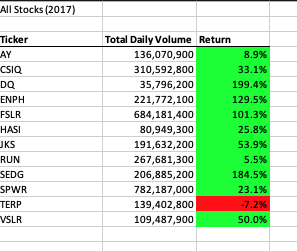
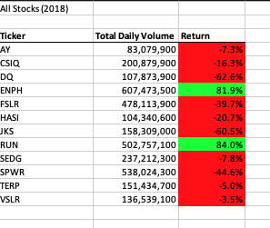

# stock-analysis

## Module 2: VBA of Wall Street

### Overview of Project
Using VBA macros to analyze an entire dataset created to track stocks by the year 2017 and 2018. This was done by an macro with a ForLoop that loops through a list of ticker sympols. Additionally after executing this macro we see can how long the code took to execute for code refactoring purposes.

### Results
According to the results we see that 2017 perfomed better than 2018 results.

### Sample code Steps

  - For loop to intialize tickerVolumes.
  - Loop through each row.
  - Assign varible for tickerIndex.
  - Use If Then statements to produce calculated values according to their conditons.

### Summary
Overall the I learned the importance of refactoring code. This makes code run faster than usual and is more efficient for when trying to execute larger datasets. However according to stackoverflow theres also disadvantages which consist of risks on the functionality of the software and lack of test cases.
